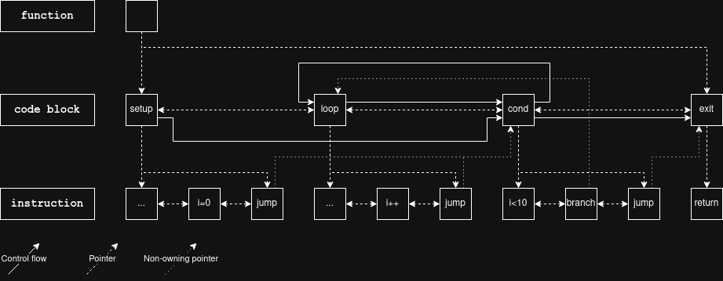

# Lily Intermediate Representation
Lily-CC employs an assembly-like intermediate representation for optimization and code generation. The most notable structures are functions (`ir_func_t`), code within said functions (`ir_code_t`) and pseudo-registers (`ir_var_t`).

## Table of Contents
- [Examples](#examples)
    - [Example: for loop](#example-for-loop)
- [Specification](#specification)
    - [Structures](#structures)
    - [Struct: Function](#struct-function)
    - [Struct: Function argument](#struct-function-argument)
    - [Struct: Code block](#struct-code-block)
    - [Struct: Instruction](#struct-instruction)
    - [Struct: Operand](#struct-operand)
    - [Struct: Return value](#struct-return-value)
    - [Struct: Variable](#struct-variable)
    - [Struct: Constant](#struct-constant)
    - [Struct: Memory reference](#struct-memory-reference)
    - [Struct: Combinator entry](#struct-combinator-entry)
    - [Struct: Stack frame](#struct-stack-frame)
- [Text representation](#text-representation)

# Examples

## Example: for loop
The following C code:
```c
void functor() {
    ...
    for (int i = 0; i < 10; i++) {
        ...
    }
}
```

Might be compiled into the following IR:
```
function functor
    entry %setup
    var %i i32
    var %var1
code %setup
    ...
    %i = mov s32'0
    jump %cond
code %loop
    ...
    %i = add %i, s32'1
    jump %cond
code %cond
    %var1 = slt %i, s32'10
    branch %loop, %var1
    jump %exit
code %exit
    ret
```

And produce an in-memory representation as shown:



# Specification

## Data types
The types that values (e.g. variables and constants) can have. Every data type has a fixed size and alignment equal to the size. All integer types are to be stored in two's complement. The size of a byte is exactly 8 bits and a byte must be the minimum addressable unit of memory.

| Type   | C equivalent  | Size (bytes) | Description
| :----- | :------------ | -----------: | :----------
| `s8`   | `int8_t`      |            1 | Signed 8-bit integer.
| `u8`   | `uint8_t`     |            1 | Unsigned 8-bit integer.
| `s16`  | `int16_t`     |            2 | Signed 16-bit integer.
| `u16`  | `uint16_t`    |            2 | Unsigned 16-bit integer.
| `s32`  | `int32_t`     |            4 | Signed 32-bit integer.
| `u32`  | `uint32_t`    |            4 | Unsigned 32-bit integer.
| `s64`  | `int64_t`     |            8 | Signed 64-bit integer.
| `u64`  | `uint64_t`    |            8 | Unsigned 64-bit integer.
| `s128` | `__int128_t`  |           16 | Signed 128-bit integer.
| `u128` | `__uint128_t` |           16 | Unsigned 128-bit integer.
| `bool` | `bool`        |            1 | One-bit truth value.
| `f32`  | `f32`         |            4 | IEEE 754 binary32 floating-point number.
| `f64`  | `f64`         |            8 | IEEE 754 binary64 floating-point number.

## Structures overview

The IR consists of the following structs:
| Name              | Struct            | Brief
| :---------------- | :---------------- | :----
| Function          | `ir_func_t`       | A collection of code blocks with calling convention information.
| Function argument | `ir_arg_t`        | How an argument is passed to a function.
| Code block        | `ir_code_t`       | A single node in the control-flow graph.
| Instruction       | `ir_insn_t`       | One abstract operation to perform at run-time.
| Operand           | `ir_operand_t`    | Operand for an instruction. Could be memory, variables, constants, etc.
| Return value      | `ir_retval_t`     | Destination of an instruction; for most, this is a variable.
| Variable          | `ir_var_t`        | Pseudo-register with a fixed data type.
| Constant          | `ir_const_t`      | A value known at compile-time.
| Memory reference  | `ir_memref_t`     | Describes a location in memory with optional data type.
| Combinator entry  | `ir_combinator_t` | Tuple of predecessor node and value binding for phi-nodes.
| Stack frame       | `ir_frame_t`      | Abstract fixed-size stack allocation.

And the following enumerations:
| Name              | Enumeration         | Brief
| :---------------- | :------------------ | :----
| Primitive type    | `ir_prim_t`         | Data types for IR operations
| Binary operator   | `ir_op2_type_t`     | Operator type for `IR_INSN_EXPR2`.
| Unary operator    | `ir_op1_type_t`     | Operator type for `IR_INSN_EXPR1`.
| Instruction type  | `ir_insn_type_t`    | Instruction type
| Operand type      | `ir_operand_type_t` | Union tag for `ir_operand_t`.
| Base address type | `ir_membase_t`      | Union tag for `base_*` in `ir_memref_t`.
| Argument type     | `ir_arg_type_t`     | Union tag for `ir_arg_t`.

The following diagram depicts how structures relate to one another and are embedded by each other:


## Struct: Function
A collection of code blocks with calling convention information.

```c
struct ir_func {
    char      *name;
    size_t     args_len;
    ir_arg_t  *args;
    ir_code_t *entry;
    // ... private fields omitted ...
    bool       enforce_ssa;
};
```

Functions own stack frames, variables (pseudo-registers) and code blocks. The code blocks are stored in a doubly-linked list that correlates with how the code is to be scheduled in the final executable. In turn, the code blocks own linked lists of instructions, the abstract unit of run-time action. Functions can optionally be in SSA (Static Single Assignment) form, where the IR library will enforce that every variable is assigned at most once. A function may be converted into SSA form by calling `ir_func_to_ssa`, though there is no need for front-ends to do this.

Creating a function using `ir_func_create` will create an empty code block and assign it to `entry`. However, it is legal to replace `entry` with some other code block and it is also legal to then delete the original using `ir_code_delete`. Similarly, `args` is also initialized with default values that are expected to be modified by the frontend.

## Struct: Function argument
How an argument is passed to a function.

```c
struct ir_arg {
    ir_arg_type_t arg_type;
    union {
        ir_var_t   *var;
        ir_frame_t *struct_frame;
        ir_prim_t   ignored_prim;
    };
};
```

Tagged union of variable, stack frame and data type. The information conveyed is used by the back-end to implement the calling convention of the function. Variable arguments are treated as the corresponding C type in the target ABI, and stack frame arguments are used to pass structs.

**WARNING: There are issues with structs in IR, please read the [struct ABI note](#struct-abi-note).**

## Struct: Code block
A single node in the control-flow graph.


## Struct: Instruction
One abstract operation to perform at run-time.


## Struct: Operand
Operand for an instruction. Could be memory, variables, constants, etc.


## Struct: Return value
Destination of an instruction; for most, this is a variable.


## Struct: Variable
Pseudo-register with a fixed data type.


## Struct: Constant
A value known at compile-time.


## Struct: Memory reference
Describes a location in memory with optional data type.


## Struct: Combinator entry
Tuple of predecessor node and value binding for phi-nodes.


## Struct: Stack frame
Abstract fixed-size stack allocation.


## Enumaration: Primitive type
[Data types](#data-types) for IR operations

```c
typedef enum __attribute__((packed)) {
    IR_PRIM_<type>, // for all IR data types
    IR_N_PRIM,
} ir_prim_t;
```

## Enumaration: Binary operator
Operator type for `IR_INSN_EXPR2`.


## Enumaration: Unary operator
Operator type for `IR_INSN_EXPR1`.


## Enumaration: Instruction type
Instruction type


## Enumaration: Operand type
Union tag for `ir_operand_t`.


## Enumaration: Base address type
Union tag for `base_*` in `ir_memref_t`.


## Enumaration: Argument type
Union tag for `ir_arg_t`.


# Text representation

# Known issues

## Struct ABI note
Issue: [lily-cc #2](https://github.com/robotman2412/lily-cc/issues/2)
