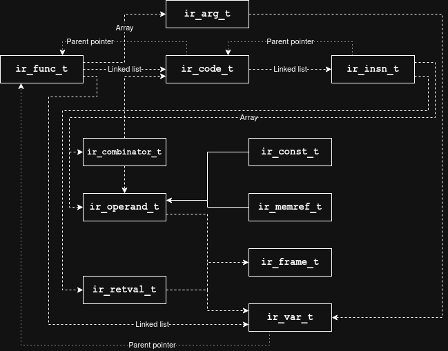

# Lily Intermediate Representation
Lily-CC employs an assembly-like intermediate representation for optimization and code generation. The most notable structures are functions (`ir_func_t`), code within said functions (`ir_code_t`) and pseudo-registers (`ir_var_t`).

# Specification

## Structural Relations

The IR consists of the following structs:
| Name              | Struct            | Brief
| :---------------- | :---------------- | :----
| Function          | `ir_func_t`       | A collection of code blocks with calling convention information.
| Function argument | `ir_arg_t`        | How an argument is passed to a function.
| Code block        | `ir_code_t`       | A single node in the control-flow graph.
| Instruction       | `ir_insn_t`       | One abstract operation to perform at run-time.
| Operand           | `ir_operand_t`    | Operand for an instruction. Could be memory, variables, constants, etc.
| Return value      | `ir_retval_t`     | Destination of an instruction; for most, this is a variable.
| Variable          | `ir_var_t`        | Pseudo-register with a fixed data type.
| Constant          | `ir_const_t`      | A value known at compile-time.
| Memory reference  | `ir_memref_t`     | Describes a location in memory with optional data type.
| Combinator entry  | `ir_combinator_t` | Tuple of predecessor node and value binding for phi-nodes.
| Stack frame       | `ir_frame_t`      | Abstract fixed-size stack allocation.

And the following enumerations:
| Name              | Enumeration         | Brief
| :---------------- | :------------------ | :----
| Primitive type    | `ir_prim_t`         | Data types for IR operations
| Binary operator   | `ir_op2_type_t`     | Operator type for `IR_INSN_EXPR2`.
| Unary operator    | `ir_op1_type_t`     | Operator type for `IR_INSN_EXPR1`.
| Instruction type  | `ir_insn_type_t`    | Instruction type
| Operand type      | `ir_operand_type_t` | Union tag for `ir_operand_t`.
| Base address type | `ir_membase_t`      | Union tag for `base_*` in `ir_memref_t`.
| Argument type     | `ir_arg_type_t`     | Union tag for `ir_arg_t`.

# Text representation
